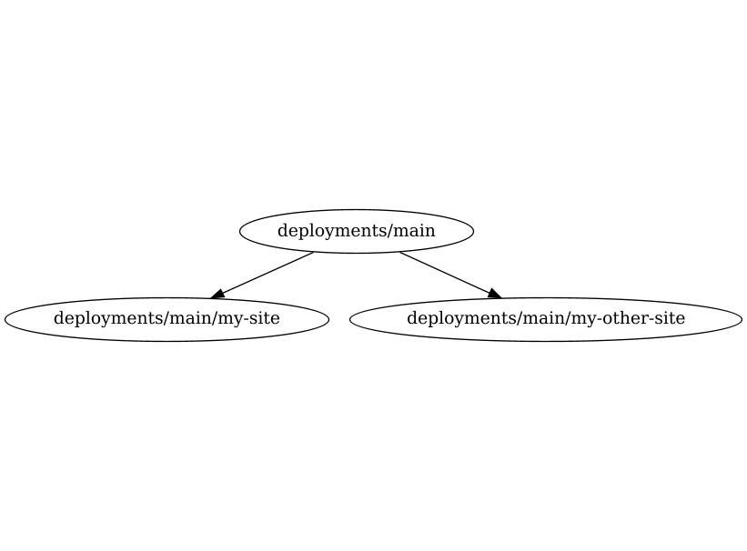
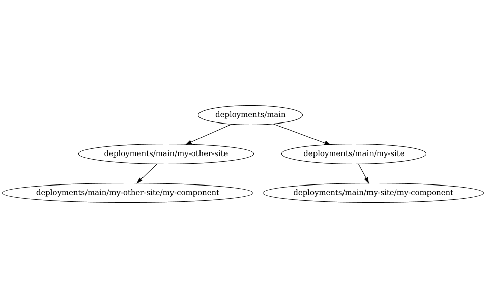
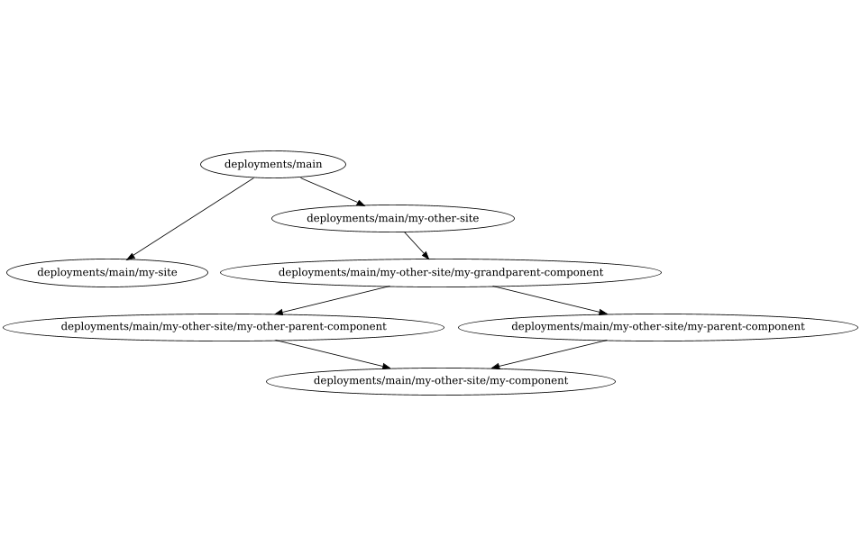

# Applying changes

Mach Composer will apply any changes in your configuration when you run
[`mach-composer apply`](../../reference/cli/mach-composer_apply.md). This will
run through several steps.

## Generate Terraform code

By default, Mach Composer will generate any missing Terraform code before
applying. It will check if the generated code is up-to-date with the current
configuration, and re-generate where necessary.

## Ordering dependencies

Mach Composer will create a dependency graph based on the configuration file.
Any components that have been marked with deployment type `site` will be grouped
with the site they are part of, with the remaining components being part of the
deployment graph. This graph will be used to determine the order in which
components should be deployed.

To preview this graph you can
run `mach-composer graph --deployment` ([see the documentation](../../reference/cli/mach-composer_graph.md)).
This will output a trimmed down version of the dependency graph where only the
independently deployable components are shown.

## Batching applies

Once the deployment graph has been determined Mach Composer will batch the
individual deployments into groups that can be run in parallel. Within this
context [`--workers`](configuration.md#the---workers-parameter) will determine
the number of workers that will be used to apply the changes.

Currently, batching happens with a naive algorithm that determines the longest
depth between a component and the root of the graph. The batch index will then
be the same as this depth. This is considered a good enough approximation for
most use cases, but may be improved in the future.

## Run applies

Once the batches have been determined, Mach Composer will run the applies in
the determined order. Any applies where it is determined no changes have
occurred will be skipped. Mach Composer will wait for all the elements of a
batch to complete before progressing to the next one. Once all batched have
completed the apply will be considered successful.

### Failures

If an error occurs during apply, Mach Composer will finish the remaining
elements in the same batch and then exit.

[//]: <> (@formatter:off)
!!! warning "Partial updates"
    Note that a failure in a component could lead to an inconsistent state. In 
    this case it is up to the developer to either roll back to the previous 
    state, or fix the issue and re-run the apply.
[//]: <> (@formatter:on)

### Planned applies

Mach Composer also supports planned applies. By
default [`mach-composer plan`](../../reference/cli/mach-composer_plan.md) will
also output plans that can be used to run an apply. This is useful in automated
processes. When mach-composer detects a pre-existing plan for any of the
components it will apply those instead of determining the changes itself. This
is useful in a CI/CD pipeline where you don't want to fetch existing
configurations multiple times.

## An example

### Simple configuration

Assume the following configuration, containing two sites with four components
each:

```yaml
# my-site.yml
mach_composer:
  version: 1
  plugins: { }
  # Note no global deployment type set, so default `site` is inherited by all components

global:
  cloud: ""
  environment: test
  terraform_config:
    remote_state:
      plugin: local
      path: ./state
sites:
  - identifier: my-site
    components:
      - name: my-component
        variables:
          parent_url: ${component.my-parent-component.url}
          other_parent_url: ${component.my-other-parent-component.url}
      - name: my-parent-component
        variables:
          grandparent_url: ${component.my-grandparent-component.url}
      - name: my-other-parent-component
        variables:
          grandparent_url: ${component.my-grandparent-component.url}
      - name: my-grandparent-component
  - identifier: my-other-site
    components:
      - name: my-component
        variables:
          parent_url: ${component.my-parent-component.url}
          other_parent_url: ${component.my-other-parent-component.url}
      - name: my-parent-component
        variables:
          grandparent_url: ${component.my-grandparent-component.url}
      - name: my-other-parent-component
        variables:
          grandparent_url: ${component.my-grandparent-component.url}
      - name: my-grandparent-component

components:
  - name: my-component
    source: ./my-component/terraform
    version: "v1.0.0"
    branch: main
  - name: my-parent-component
    source: ./modules/application
    version: "v1.2.1"
    branch: main
  - name: my-other-parent-component
    source: ./modules/application
    version: "v1.2.1"
    branch: main
  - name: my-grandparent-component
    source: ./modules/application
    version: "v2.0.0"
    branch: main
```

This results in the following simple deployment graph



When running `mach-composer apply` first the apply will run on `my-site`, and
after on `my-other-site`. This applies will contain all the site components.

### Move out top level components

Now assume we move out the top level components to be of `site-component`
deployment type

```yaml
sites:
  - identifier: my-site
    components:
      - name: my-component
        deployment:
          type: site-component
        variables:
          parent_url: ${component.my-parent-component.url}
          other_parent_url: ${component.my-other-parent-component.url}
      # Etc...
  - identifier: my-other-site
    components:
      - name: my-component
        variables:
          parent_url: ${component.my-parent-component.url}
          other_parent_url: ${component.my-other-parent-component.url}
        deployment:
          type: site-component
      # Etc...
```

This will result in the following:



If we now run `mach-composer apply --workers 2` the first batch will apply both
sites in parallel. After these have completed the second batch will apply both
versions of `my-component` in parallel.

### More complex structure

Alternatively you could change one site to be fully `site-component`, while
keeping the other site as `site`

```yaml
sites:
  - identifier: my-site
    components:
    # Etc...
  - identifier: my-other-site
    deployment:
      type: site-component
    components:
    # Etc...
```

This will result in the following:



Here for `my-site` all components will be deployed as part of the site, while
in `my-other-site` all components will be deployed independently. Whichever
deployment style you choose, Mach Composer will always determine the correct
order and batch to apply the components in.

Ultimately you can tailor it to your needs, and mix and match as you see fit.
