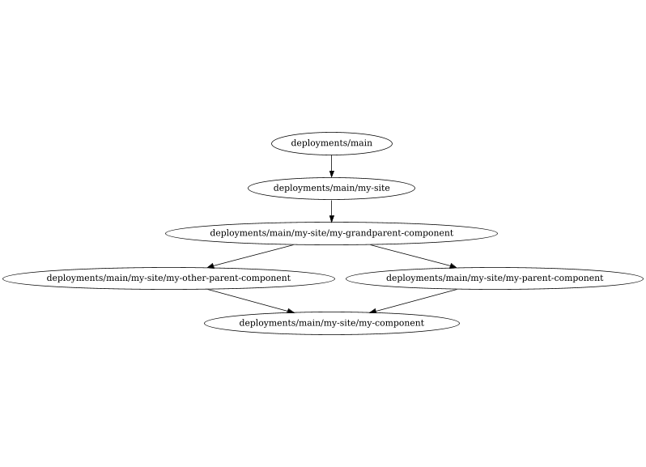
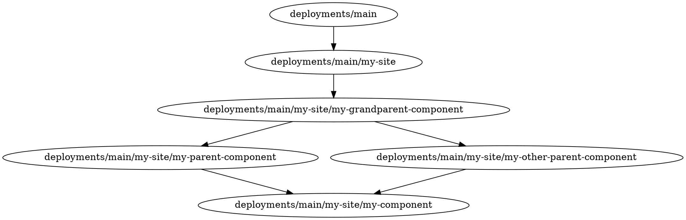

# Managing dependencies

To ensure that components are deployed in the correct order, Mach Composer will
create a dependency graph based on the configuration file. This graph will
be used to determine the order in which components should be deployed. It will
also batch any changes to unrelated components so they can be run in parallel.
See the [configuration documentation](configuration.md) for more information on
what options there are to configure dependencies.



## Determining dependencies

Mach Composer will determine the dependencies between components based on what
variables a component requires from another component. For example, if a
component requires an url provided in the output of another url, it is
considered dependent on that component.

For example the following configuration will tell Mach Composer
that `my-component` depends on `my-parent-component` based on the input
variable `url`:

```yaml
sites:
  - identifier: my-site
    components:
      - name: my-component
        variables:
          parent_url: ${component.my-parent-component.url}
      - name: my-parent-component
```

[//]: <> (@formatter:off)
!!! warning "Component outputs"
    For this to work correctly, the component that is depended on must actually 
    have `url` as an output. See [terraform outputs](https://developer.hashicorp.com/terraform/language/values/outputs). 
    Make sure your component configuration code actually includes the output, 
    as Mach Composer will only fail at runtime if the output is missing. 
[//]: <> (@formatter:on)

Alternatively, these dependencies can be specified explicitly using
the `depends_on` configuration for site components:

```yaml
sites:
  - identifier: my-site
    components:
      - name: my-component
        depends_on:
          - my-parent-component
      - name: my-parent-component
```

By default, if no dependencies are specified, Mach Composer will
consider the component only dependent on the site it is part of.

```yaml
sites:
  - identifier: my-site
    components:
      # Both components are allowed to be deployed at the same time
      - name: my-component
      - name: my-parent-component
```

If a dependency is specified that would lead to a circular dependency, Mach
Composer will throw an error when reading the configuration file.

```yaml
sites:
  - identifier: my-site
    components:
      # This configuration is impossible and will throw an error
      - name: my-component
        depends_on:
          - my-parent-component
      - name: my-parent-component
        depends_on:
          - my-component
```

## Visualizing dependencies

To help you understand the dependencies between your components, Mach Composer
can plot a graph of the dependencies between components. This can be done using
the [`mach-composer graph` command](../../reference/cli/mach-composer_graph.md):

```bash
$ mach-composer graph -f my-site.yml
```

This will create a graph in
the [DOT language](https://graphviz.org/doc/info/lang.html)

For example take the following configuration:

```yaml
# my-site.yml
mach_composer:
  version: 1
  plugins: { }

global:
  cloud: ""
  environment: test
  terraform_config:
    remote_state:
      plugin: local
      path: ./state
sites:
  - identifier: my-site
    components:
      - name: my-component
        variables:
          parent_url: ${component.my-parent-component.url}
          other_parent_url: ${component.my-other-parent-component.url}
      - name: my-parent-component
        variables:
          grandparent_url: ${component.my-grandparent-component.url}
      - name: my-other-parent-component
        variables:
          grandparent_url: ${component.my-grandparent-component.url}
      - name: my-grandparent-component

components:
  - name: my-component
    source: ./my-component/terraform
    version: "v1.0.0"
    branch: main
  - name: my-parent-component
    source: ./modules/application
    version: "v1.2.1"
    branch: main
  - name: my-other-parent-component
    source: ./modules/application
    version: "v1.2.1"
    branch: main
  - name: my-grandparent-component
    source: ./modules/application
    version: "v2.0.0"
    branch: main
```

This will create the following graph:



This is the DOT language representation of the graph at the top of the page.

