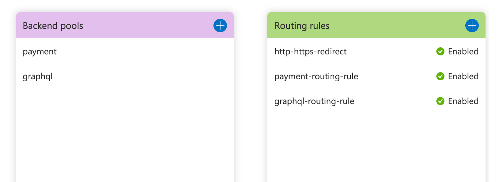

# Azure deployments

## Resource groups

MACH composer will create a **[resource group](https://registry.terraform.io/providers/hashicorp/azurerm/latest/docs/resources/resource_group) per site**.

!!! info ""
    Only when a [`resource_group`](../../plugins/azure.md)
    is explicitly set, it won't be managed by MACH composer.

## HTTP routing



Only when a MACH composer stack contains components that have
[`endpoints`](../../reference/syntax/component.md) defined, MACH composer
will set up a **Frontdoor instance** to be able to route traffic to that component.

### Default endpoint

If you have defined your component with a `default` endpoint, MACH composer will
create a Frontdoor instance for you which includes the default Azure domain.

```yaml
components:
  - name: payment
    source: git::ssh://git@github.com/your-project/components/payment-component.git//terraform
    endpoints:
      public: default
    version: ....
```

!!! note ""
    This `default` endpoint doesn't need to be defined in your [endpoints' definition](../../reference/syntax/site.md#nested-schema-for-endpoints).

### Custom endpoint

Whenever a custom endpoint from your [endpoints definition](../../reference/syntax/site.md#nested-schema-for-endpoints)
is used, MACH composer will require that you have configured
[`frontdoor`](../../plugins/azure.md) for additional DNS
information that it needs to set up your Frontdoor instance.

In addition to that it will also set up the necessary DNS record.

### Component routing

For each component with an `endpoint` MACH composer will add a route to the
Frontdoor instance using the name of the component.

So when having the following components defined:

```yaml
components:
  - name: payment
    source: git::ssh://git@github.com/your-project/components/payment-component.git//terraform
    endpoints:
      public: main
    version: ....
  - name: api-extensions
    source: git::ssh://git@github.com/your-project/components/api-extensions-component.git//terraform
    version: ....
  - name: graphql
    source: git::ssh://git@github.com/your-project/components/graphql-component.git//terraform
    endpoints:
      public: main
    version: ....
```

The routing in Frontdoor that will be created:



!!! tip "Frontdoor resource"
    An important thing to keep in mind is that the
    [Frontdoor resource](https://registry.terraform.io/providers/hashicorp/azurerm/latest/docs/resources/frontdoor)
    in Terraform is managed as a single resource, including all the routing to
    the components.

## App service plans

What kind and how many service plans it will create depends on what service
plans are needed by the components, and how the
[`service_plans`](../../plugins/azure.md)
configuration looks like.

By default, MACH composer will create a `default` service plan which is a
Consumption plan, if any of the components have `service_plan: default` set in
their configuration.

In this case, you don't need to define the service plan yourself, MACH composer
automatically creates this default for you:

```yaml
service_plans:
  default:
    kind: "FunctionApp"
    tier: "Dynamic"
    size: "Y1"
```

## Action groups

When an [Alert group](../../plugins/azure.md) is
configured, an [Action group](https://registry.terraform.io/providers/hashicorp/azurerm/latest/docs/resources/monitor_action_group)
will be created.

Components can use that action group to attach alert rules to.
