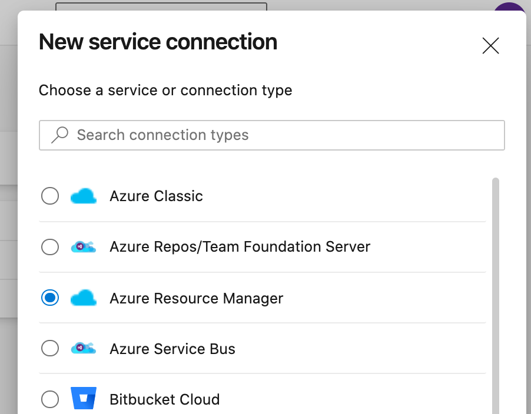
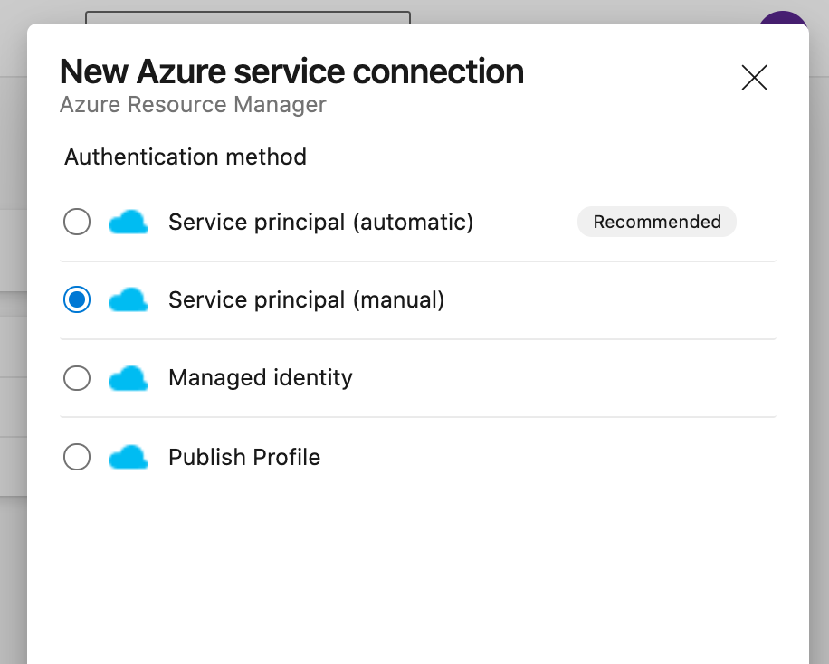
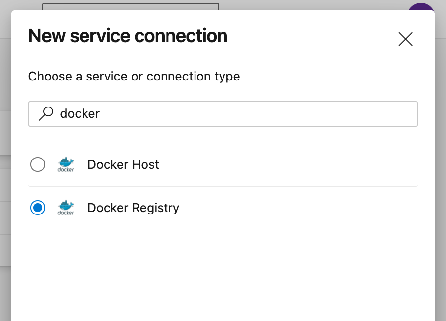
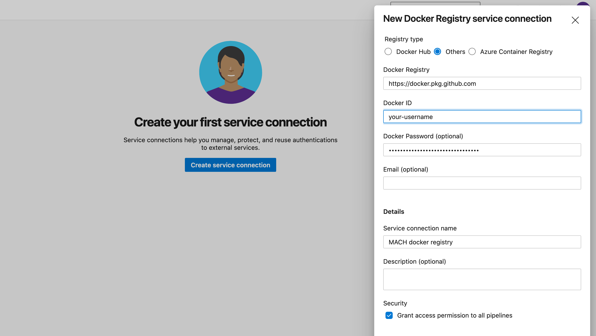

# Deploy using Azure DevOps pipelines

This section will describe how to setup your CI/CD pipeline using DevOps including some examples.

## MACH stack

How to set up the deployment process fro your MACH configuration.

### Providing credentials

The pipeline must be able to;

- [Pull the private MACH docker](#mach-docker-image) image from GitHub
- [Access the component repositories](#component-repositories)
- [Manage resources in the Azure environment](#manage-azure)


#### 1. Create KeyVault
Start off by creating a KeyVault in which we can store credentials needed in the pipeline

```bash
$ az keyvault create --name myprefix-devops-secrets --resource-group my-shared-we-rg
```

#### 2. Azure service connection
We need to **provide access to Azure** using a service connection.

The pipeline needs this to be able to access the KeyVault to pull in other credentials with.

1. Go to your *Project settings*
2. Choose **Pipelines** > **Service connections**
3. Choose 'Azure Resource Manager'<br>
   {: style="max-width:350px; padding-right: 20px"}{: style="max-width:350px"}<br>
   And then 'Service principle (automatic)' or 'manual' depending on your situation and permissions.
4. Enter the credentials needed.<br>
   The name given in **Service connection name** will be used later in the pipeline.

#### 3. MACH docker image

Since the MACH docker image is hosted on a private GitHub repository, we need to make sure your pipeline has access to it.

We do this by creating a service connection, and using that service connection later in our pipeline configuration.

1. Go to your *Project settings*
2. Choose **Pipelines** > **Service connections**
3. Choose 'Docker Registry'<br>
   {: style="max-width:400px"}
4. Enter `https://docker.pkg.github.com` as Docker registry and fill in your GitHub username and personal access token.<br>
   The name given in '**Service connection name**' will be used later in the pipeline
   

#### 4. Component repositories
1. Generate a SSH key pair.  [Instructions](https://docs.microsoft.com/en-us/azure/devops/repos/git/use-ssh-keys-to-authenticate?view=azure-devops#step-1-create-your-ssh-keys).
2. Add the public key to the [SSH public keys](https://docs.microsoft.com/en-us/azure/devops/repos/git/use-ssh-keys-to-authenticate?view=azure-devops#step-2--add-the-public-key-to-azure-devops-servicestfs) of a user that has (at least read-) access to the component repositories.
3. Store the private key in the KeyVault.<br>
   ```bash
   $ az keyvault secret set --name "SSHPrivateKey" --value "$(cat id_rsa)" --vault-name my-devops-secrets
   ```

#### 5. Provide SP credentials

The MACH composer needs to be able to login to Azure to manage the resources.<br>
We need to be able to provide the following environment variables:

- `ARM_CLIENT_ID`
- `ARM_CLIENT_SECRET`
- `ARM_SUBSCRIPTION_ID`
- `ARM_TENANT_ID`
  
In this case, we're going to store the `ARM_CLIENT_ID` and `ARM_CLIENT_SECRET` in the KeyVault, so we don't have to hard code it in the pipeline.

```bash
$ az keyvault secret set --name "DevOpsClientID" --value "..." --vault-name my-devops-secrets
$ az keyvault secret set --name "DevOpsClientSecret" --value "..." --vault-name my-devops-secrets
```

### Example
```yaml
trigger:
- master

pool:
  vmImage: 'ubuntu-latest'

variables:
  SP_TENANT_ID: <your-tenant-id>
  SP_SUBSCRIPTION_ID: <your-subscription-id>

steps:
- task: AzureCLI@2
  displayName: Fetch SSH private key
  inputs:
    azureSubscription: <service-connection-name>
    scriptType: bash
    scriptLocation: inlineScript
    inlineScript: 'az keyvault secret download --vault-name myprefix-devops-secrets -n SSHPrivateKey -f id_rsa'
- task: AzureKeyVault@1
  displayName: Get secrets
  inputs:
    azureSubscription: <service-connection-name>
    KeyVaultName: myprefix-devops-secrets
    SecretsFilter: 'DevOpsClientID,DevOpsClientSecret'
    RunAsPreJob: true
- script: |
    mkdir -p ssh
    mv id_rsa ssh/id_rsa
    echo "" >> ssh/id_rsa
    chmod 600 ssh/id_rsa
    ssh-keyscan ssh.dev.azure.com > ssh/known_hosts
  displayName: Prepare credentials
- task: Docker@2
  inputs:
    containerRegistry: '<docker-service-connection-name>'
    command: 'login'
- script: |
    docker run --rm \
    --volume $(pwd)/ssh:/root/.ssh \
    --volume $(pwd):/code \
    -e ARM_CLIENT_ID=$(DevOpsClientID) \
    -e ARM_CLIENT_SECRET=$(DevOpsClientSecret) \
    -e ARM_SUBSCRIPTION_ID=$SP_SUBSCRIPTION_ID \
    -e ARM_TENANT_ID=$SP_TENANT_ID \
    docker.pkg.github.com/labd/mach-composer/mach:0.4.2 \
    apply --with-sp-login --auto-approve -f main.yml
  displayName: Apply
```

## Components

For the component CI pipeline we need to be able to test, package and upload the function app ZIP file.

### Setup Azure service connection

Just as in the [step for setting up the MACH stack](#2-azure-service-connection), we need to add an Azure service connection so that the pipeline can upload the function apps to the storage account.

The *Service connection name* will be used later in the pipeline.


### Example

Example DevOps CI configuration.

See the [Components deployment](../components.md#package-upload-script) section for examples of the package/upload script used here.

=== "Python"
  ```yaml
  trigger:
  - master

  pool:
    vmImage: 'ubuntu-latest'

  steps:
  - script: |
      curl https://packages.microsoft.com/keys/microsoft.asc | gpg --dearmor > microsoft.gpg
      sudo mv microsoft.gpg /etc/apt/trusted.gpg.d/microsoft.gpg
      sudo sh -c 'echo "deb [arch=amd64] https://packages.microsoft.com/repos/microsoft-ubuntu-$(lsb_release -cs)-prod $(lsb_release -cs) main" > /etc/apt/sources.list.d/dotnetdev.list'
      sudo apt-get update
      sudo apt-get install azure-functions-core-tools-3
    displayName: Install core tools

  - task: UsePythonVersion@0
    inputs:
      versionSpec: '3.8'
    displayName: 'Use Python 3.8'

  - script: |
      python -m pip install --upgrade pip
      pip install -r requirements.txt
    displayName: 'Install dependencies'

  - script: |
      pip install pytest pytest-azurepipelines
      pytest
    displayName: 'Test'

  - script: ./azure_package.sh package
    displayName: Package

  - task: AzureCLI@2
    displayName: Upload
    inputs:
      azureSubscription: '<azure-service-connection>'
      scriptType: bash
      scriptPath: ./azure_package.sh
      arguments: upload
  ```

!!! note
    In the example, you'll see a script to install the *Azure functions core tools*.
    The functions core tools cannot be injected in the pipeline easier because of a still unresolved bug.<br>
    See: [https://github.com/Azure/azure-functions-core-tools/issues/1899](https://github.com/Azure/azure-functions-core-tools/issues/1899)