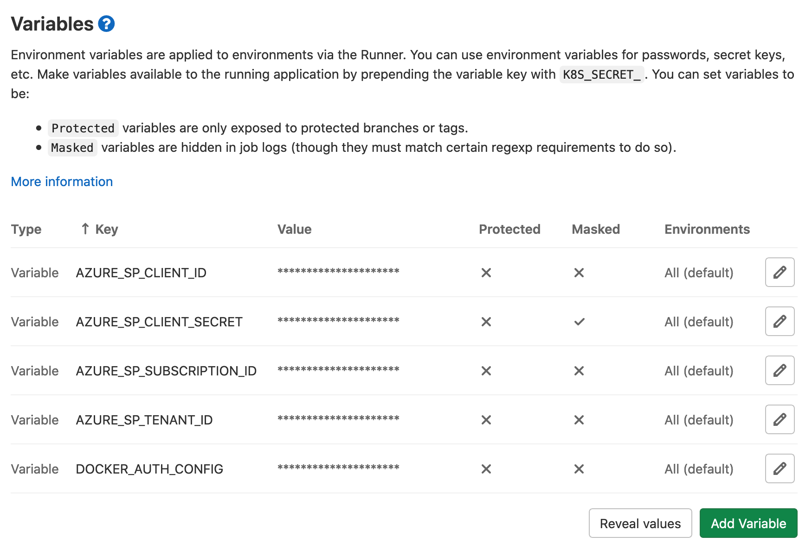

# Deploy using GitLab CI/CD

This section will describe how to setup your CI/CD pipeline using GitLab
including some examples.

!!! warning "Gitlab CI/CD documentation is no longer maintained"

    While it is perfectly possible to implement MACH composer in a Gitlab CI/CD pipeline, we will not be updating its documentation anymore, as Github Actions seems to be the preferred CI/CD solution for most of our users.

    For a current implementation of a GitHub CI/CD flow, please see the [Github CI/CD documentation of MACH composer](./github.md).

## MACH stack deployment

How to set up the deployment process for your MACH composer configuration.

### Providing cloud credentials

We have to make sure the the necessary AWS or Azure credentials are set in the
GitLab CI/CD settings;



### Access to component repositories

When MACH composer is applied it will have to download the various components
from their Git repositories.<br>
We have to make sure the current runner has access to those.

Most probably you'll have the CI for the MACH composer configuration running
under the same GitLab account as the components itself.<br>
In that case you can use the [`CI_JOB_TOKEN`](https://docs.gitlab.com/ee/ci/variables/predefined_variables.html)
variable and place it in a [`.netrc`](https://docs.gitlab.com/ee/user/project/new_ci_build_permissions_model.html#dependent-repositories)
file so that other repositories can be accessed (see [example](#example)):

```yaml
# Run the following script before any deploy
- mkdir -p ~/.ssh
- chmod 700 ~/.ssh
- ssh-keyscan your.gitlab-domain.com >> ~/.ssh/known_hosts
- chmod 644 ~/.ssh/known_hosts
- echo -e "machine your.gitlab-domain.com\nlogin gitlab-ci-token\npassword ${CI_JOB_TOKEN}" > ~/.netrc
```

### Terraform plugin cache

To speed up deployments and avoid re-downloads of each provider and module, we
can set a `TF_PLUGIN_CACHE_DIR` as described in the
[MACH deployment section](../../topics/deployment/config/index.md#cache-terraform-providers).

### Example

=== "AWS"

      ```yaml
      ---
      image: docker.pkg.github.com/mach-composer/mach-composer-cli/mach:0.4

      cache:
        paths:
         - $CI_PROJECT_DIR/tf-cache
        key: $CI_PROJECT_ID

      variables:
        AWS_DEFAULT_REGION: $AWS_DEFAULT_REGION
        AWS_ACCESS_KEY_ID: $AWS_ACCESS_KEY_ID
        AWS_SECRET_ACCESS_KEY: $AWS_SECRET_ACCESS_KEY
        TF_PLUGIN_CACHE_DIR: $CI_PROJECT_DIR/tf-cache

      before_script:
        - mkdir -p ~/.ssh
        - chmod 700 ~/.ssh
        # Replace with your custom GitLab domain<br>
        - ssh-keyscan your.gitlab-domain.com >> ~/.ssh/known_hosts
        - chmod 644 ~/.ssh/known_hosts
        - echo -e "machine your.gitlab-domain.com\nlogin gitlab-ci-token\npassword ${CI_JOB_TOKEN}" > ~/.netrc

      deploy:
        script:
          - mach-composer apply --auto-approve -f $CI_PROJECT_DIR/main.yml
      ```
=== "Azure"

      ```yaml
      ---
      image: docker.pkg.github.com/mach-composer/mach-composer-cli/mach:2.0.0

      cache:
        paths:
         - $CI_PROJECT_DIR/tf-cache
        key: $CI_PROJECT_ID

      variables:
        ARM_CLIENT_ID: $AZURE_SP_CLIENT_ID
        ARM_CLIENT_SECRET: $AZURE_SP_CLIENT_SECRET
        ARM_SUBSCRIPTION_ID: $AZURE_SP_SUBSCRIPTION_ID
        ARM_TENANT_ID: $AZURE_SP_TENANT_ID
        TF_PLUGIN_CACHE_DIR: $CI_PROJECT_DIR/tf-cache

      before_script:
        - mkdir -p ~/.ssh
        - chmod 700 ~/.ssh
        # Replace with your custom GitLab domain<br>
        - ssh-keyscan your.gitlab-domain.com >> ~/.ssh/known_hosts
        - chmod 644 ~/.ssh/known_hosts
        - echo -e "machine your.gitlab-domain.com\nlogin gitlab-ci-token\npassword ${CI_JOB_TOKEN}" > ~/.netrc

      deploy:
        script:
          - mach-composer apply --auto-approve --with-sp-login -f $CI_PROJECT_DIR/main.yml
      ```

## Component deployment

Example GitLab CI configuration

=== "Python"

  ```yaml
  stages:
    - test
    - build
    - deploy

  image: mcr.microsoft.com/azure-functions/python:3.0-python3.8-core-tools

  variables:
    PIP_CACHE_DIR: "$CI_PROJECT_DIR/pip-cache"

  cache:
    paths:
      - "$CI_PROJECT_DIR/pip-cache"
    key: "$CI_PROJECT_ID"

  test:
    image: python:3.7.5
    stage: test
    script:
      - pip install -r requirements_dev.txt
      - py.test tests/ --cov=. --cov-report=term-missing --cov-report=xml:reports/coverage.xml --junit-xml=reports/junit.xml
    artifacts:
      reports:
        junit: reports/junit.xml
        cobertura: reports/coverage.xml
      paths:
        - reports/junit.xml
        - reports/coverage.xml

  build:
    stage: build
    script:
      - make pack
    artifacts:
      paths:
        - build/*.zip
      expire_in: 1 day

  deploy:
    stage: deploy
    script:
      - az login --service-principal -u $AZURE_SP_CLIENT_ID -p $AZURE_SP_CLIENT_SECRET --tenant $AZURE_SP_TENANT_ID
      - az account set --subscription $AZURE_SP_SUBSCRIPTION_ID
      - make upload
  ```
