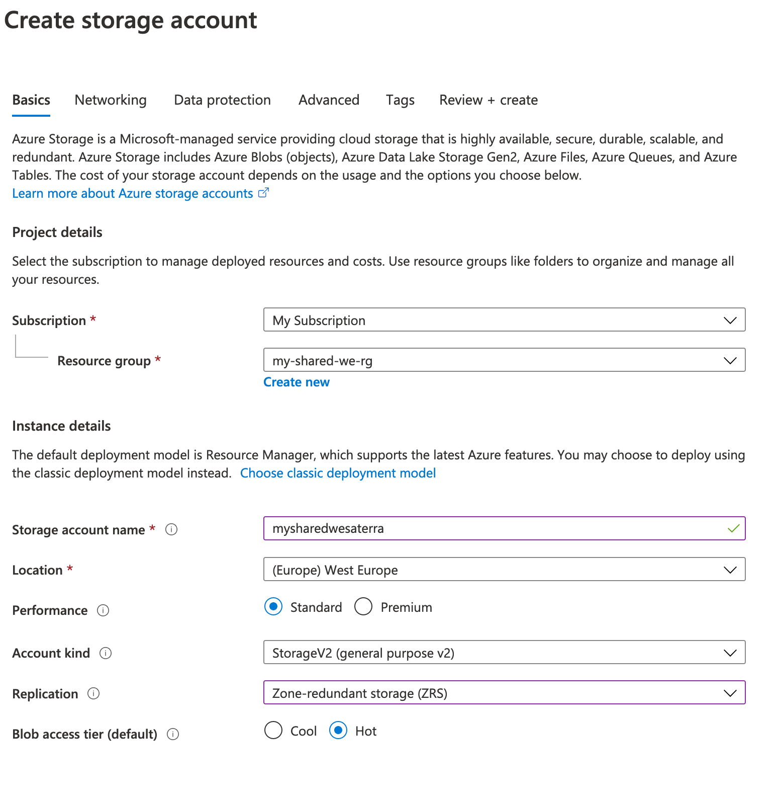

# Setting up Azure

An Azure environment should have the following;

1. Storage account for [Terraform states](#create-terraform-storage)
2. Storage account for [function app code packages](#create-function-app-storage)
3. [Registered providers](#register-providers) needed for various services

Setup can be done using [Terraform](#using-terraform) or [manually](#manual-setup).

## Using Terraform

1. Login to your Azure subscription through the CLI.
```bash
$ az login
```
Follow the prompts. On success, the CLI will respond with a JSON object of the subscriptions available to you.  
Make sure the subscription you want to work in is set to default. If it is not, you can run  
`az account set --subscription <name or id>`
2. Setup your Terraform configuration.
In main.tf:
```hcl
terraform {
  required_version = ">= 0.13.0"
}
```
In modules.tf:
```
module "shared_infra" {
  source         = "git@github.com:mach/terraform/terraform-azure-shared-infra.git"
  name_prefix    = "mach-shared-we"  # replace 'mach' with your desired prefix
  region         = "westeurope"
  dns_zone_name  = "example.com"
  certificate_access_object_ids = [
     ... # User, group or principle IDs that should have access to the resources
  ]
}
```
[More info](https://github.com/mach/terraform/terraform-azure-shared-infra) about the shared infra module.

3. Run the following commands:
```bash
$ terraform init
$ terraform apply
```
4. For a new Terraform setup, initially it will store the Terraform state locally and should be named `terraform.tfstate`.  
   We'll move this state to the Storage Account that has been created by the shared infra module.  
   To do this, add a backend setting to project like below
```hcl
terraform {
 required_version = ">= 0.13.0"
 backend "s3" {
 }
}
```
5. Now run:
```bash
$ terraform init -reconfigure 
```
Terraform will detect that you're trying to move your state into S3 and ask; "*Do you want to copy existing state to the new backend?*".  
Enter **"yes"**.  
Now the state is stored in the Storage Account and the DynamoDB table will be used to lock the state to prevent concurrent modifications.
6. Check if `terraform.tfstate` is empty and remove it.  
   Repeat the above three steps for all other environments

## Manual setup

### Create Terraform storage

#### Storage account
Create a storage account which will be used as Terraform state backend.




!!! tip
    A good convention is to place the Terraform state backend storage account in a 'shared' resource group which can be used for various shared resources accross all your environments and sites.  
    For example:  
    **Resource group**: `my-shared-we-rg`  
    **Storage account** `mysharedwesaterra`  
    Where 'my' is replaced by a prefix of your choosing.

#### Create container
Create a container in the storage account. Name it for example `tfstate`.

### Create function app storage
All packaged function app code should be stored on the shared environment from where all other envirnoment can access those assets.

#### Storage account

Create a new `BlockBlobStorage` with a Premium account tier for improved performace.

!!! tip
    Again, like the Terraform state, place this in a 'shared' resource group
    For example:  
    **Resource group**: `my-shared-we-rg`  
    **Storage account** `mysharedwesacomponents`  
    Where 'my' is replaced by a prefix of your choosing.

#### Create container

Create a blob container called `code`. Make this private.

### Register providers

Make sure the following providers are registered on the subscription:

- `Microsoft.Web`
- `Microsoft.KeyVault`
- `Microsoft.Storage`

More info:  
[https://docs.microsoft.com/en-us/azure/azure-resource-manager/templates/error-register-resource-provider](https://docs.microsoft.com/en-us/azure/azure-resource-manager/templates/error-register-resource-provider)