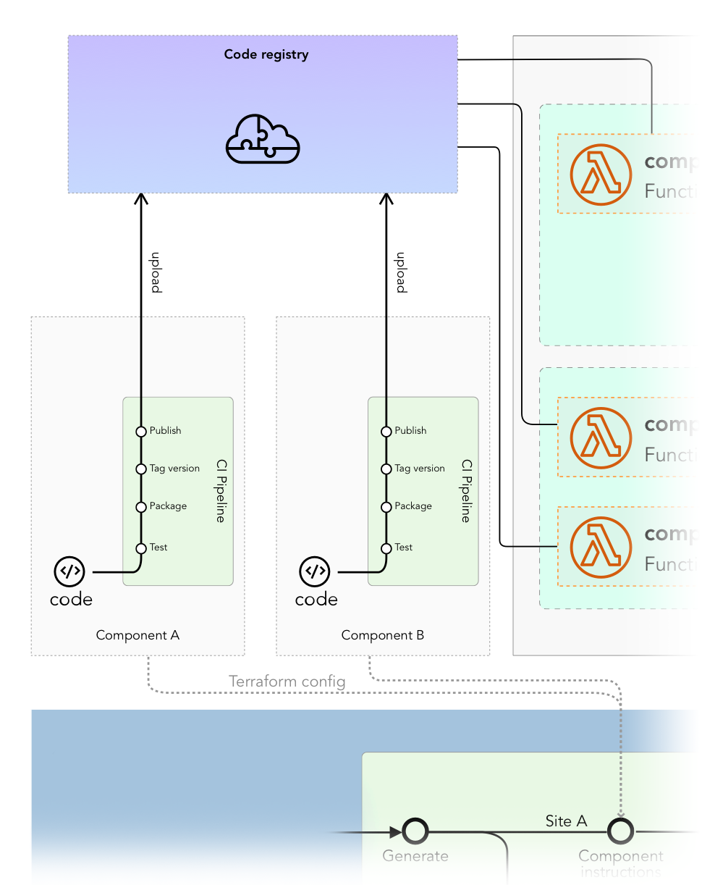

# What makes a component

A MACH component should be a single repository specifically to provide **domain-specific** functionality.

A single component can consist of one or more of the following things:

- one or more serverless functions
- other cloud specific infrastructure

Or a MACH service specific functionality or configuration like:

- custom commercetools objects
- a commercetools API extension

!!! hint "Component essentials"
    A MACH component is in it's bare minimum a [*Terraform module*](https://www.terraform.io/docs/configuration/modules.html).

    Other then the [Terraform configuration](#terraform-component), a component might include a [serverless function](#serverless-function) for custom logic to be executed runtime.

## One component per domain

In order to make your MACH stack truly composable, components should be designed so that it serves to provide functionality for a specific domain within your entire commerce environment.

#### Simple components
For some components, the *domain* and thus the implementation is quite straight-forward and clear, like for example a component responsible for **handling payments** or a component that should **sends a confirmation email** upon a new order.

#### Complex components
Some components might be a bit more complex, but still a good fit for a single component; 
For example an **ERP component** that imports data from an ERP system and exports commercetools order data to be imported in the ERP. 
This might include multiple serverless functions that receive different triggers for example:

- New object is upload to a S3 bucket or Storage account
- New order is received through a commercetools Order

Instead of provided these seperate pieces of functionality in two seperate components, it would make more sense to include that in one component so that when including that component in your MACH stack, all ERP-related functionality is taken care of.

## Deployment process

The deployment of a full-fledged component typically flows through the following steps:

1. In case of a **serverless function** it is **built**, **packaged** and **uploaded** to a shared resources all environments and sites can access. 
   **Note:** at this point, no actual deployment is made; the function doesn't run yet.
2. At the moment MACH composer deploys a site's Terraform configuration, it uses the component's Terraform configuration to make the necessary modifications to the resources. 
   For example: create the function app instance, necessary routing, etc.
3. MACH composer will use the packaged function (from step 1) to deploy the function itself

!!! info "Simple components"
      Not all components need to be a serverless function. A component might be just a set of Terraform instructions to, for example, create a custom product type in commercetools. 
      In that case, step 1 and 3 will be skipped.

Zooming in on the [main diagram](../../tutorial/intro.md#how-does-it-work), you'll see the steps illustrated.

{: style="max-width:600px"}

## Terraform module

The component must be able to instruct MACH wat resources to create in the cloud infrastructure.
This is done by providing the necessary Terraform module files in the component.

!!! tip ""
      A good practise usually is to place all Terraform files in a single `terraform/` directory and reference that in your MACH configuration.
