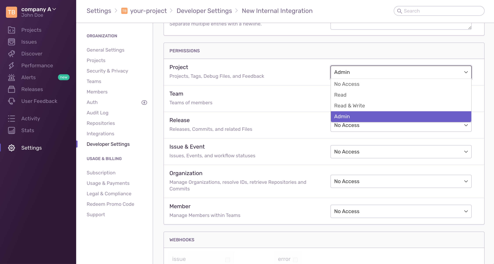

# Sentry

You can define a predefined Sentry [DSN](https://docs.sentry.io/product/sentry-basics/dsn-explainer)
for your components to use during runtime to report to your Sentry project.

It's also possible for MACH composer to manage the keys (and DSN values) for
you.  This allows you to generate a unique DSN per component as well as have
fine-grained control over rate-limiting.

To let MACH composer manage your DSN values, you need to define an
**auth token**, **project** and **organization**.

## Create auth token

Create a new internal integration and choose **Project: Admin** as permissions. 
The rest can be left empty.

## Configure MACH composer

Use that token to configure your MACH composer environment:

{{ external_markdown('https://raw.githubusercontent.com/mach-composer/mach-composer-plugin-sentry/main/README.md', '## Usage') }}

The rate limits can also be defined/overwritten on [`site`](../../reference/syntax/sites.md)
and [`component`](../../reference/syntax/sites.md#components) level

## Integrate with components

When `sentry` is set as a [component integration](../../reference/components/structure.md#integrations),
the component should have the following Terraform variables defined:

- `sentry_dsn`

If the integration is set, MACH composer will;

- Generate a new DSN for the component
- Assign the DSN to the `sentry_dsn` variable

!!! info ""
    More information on the [sentry integration on components](../../reference/components/structure.md#sentry)
