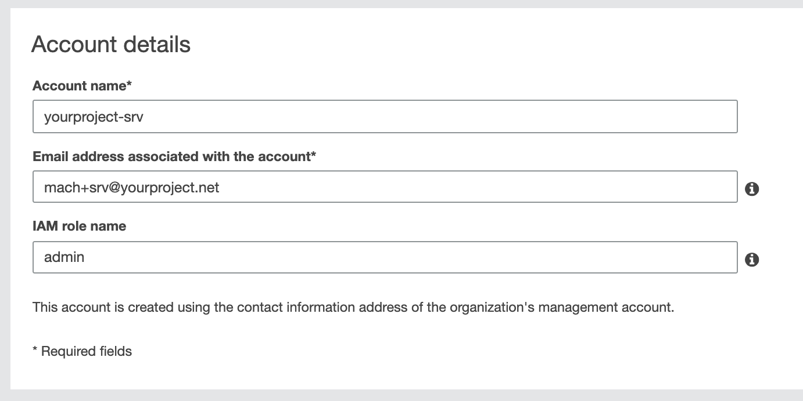

# Step 3. Add AWS services account

In AWS we need two accounts:

1. [**Service account**](#setup-service-account) for any shared resources amongst all MACH stacks
2. [**Site-specific account**](./step-4-setup-aws-site.md) for resources specific to a single MACH stack

In this step we'll create the first one, the service account.

!!! tip "Tenancy model"
      As described in the [tenancy model](../../topics/architecture/tenancy.md#aws-tenancy), we advice to setup your MACH environment by creating **one service AWS account** containing shared resources and create an **AWS account per stack**.

      This way, all resources are strictly separated from eachother.


## Setup service account

For this account we will create a;

1. **Terraform state backend** to store the infrastructure state
2. **Artifact repository** to deploy all MACH components to

### 1. Create AWS account

- In your AWS console, go to **My Organization** and choose **Add accounts**
- For your new account choose a name like `your-project-srv` or `your-project-shared`
- As **IAM role name** enter `admin` [^1]

{: style="max-width: 600px"}

!!! info "No root AWS account yet?"
    Go to [AWS support](https://aws.amazon.com/premiumsupport/knowledge-center/create-and-activate-aws-account/)
    for instructions on how to setup your AWS root account.

### 2. Setup your Terraform configuration

Create a directory / Git repository with two subdirectories:

- `service`
- `mach-account`

!!! info "Directory structure"
    We will use `mach-account` later when [setting up our AWS site account](step-4-setup-aws-site.md).

    For now, we'll work in the `service` directory

#### `variables.tf`

```terraform
variable "aws_account_id" {
  default = "<your-account-id>"
}

variable "name" {
  default = "your-project" # Replace with the actual project name
}

variable "region" {
  default = "eu-central-1"
}
```

#### `main.tf`

```terraform
locals {
  role_arn = "arn:aws:iam::${var.aws_account_id}:role/admin"
}

provider "aws" {
  region  = var.region

  assume_role {
    role_arn = local.role_arn
  }
}
```

#### `modules.tf`

```terraform
module "tfstate-backend" {
  source                             = "cloudposse/tfstate-backend/aws"
  version                            = "0.33.0"
  s3_bucket_name                     = "${var.name}-srv-tfstate"
  role_arn                           = local.role_arn

  terraform_backend_config_file_path = "."
  terraform_backend_config_file_name = "backend.tf"
}

module "shared-config" {
  source            = "git::https://github.com/labd/terraform-aws-mach-shared.git"
  code_repo_name    = "${var.name}-lambdas"
  aws_account_alias = "${var.name}-srv"
  allow_assume_deploy_role = [
    "arn:aws:iam::000000000000:user/admin" # Specify your root account here
  ]
}
```

!!! info "`allow_assume_deploy_role`"
    We specify our root account here, so it makes it easier for this tutorial to
    setup credentials to be able to deploy the components.

### 3. Terraform apply

1. Within your `service` directory, run the following commands:
```bash
$ terraform init
$ terraform apply
```
2. Terraform has now created a `backend.tf` file which instructs Terraform to
store the state on a S3 bucket.<br>
In order to move the current (local) state file to the bucket, perform this
one-time command:
```bash
$ terraform init -force-copy
```
Now the state is stored in the S3 bucket, and the DynamoDB table will be used to
lock the state to prevent concurrent modification.

!!! tip "Next: step 4"
    Next we'll setup the [AWS account for a MACH stack](step-4-setup-aws-site.md).

[^1]: For the sake of simplicity we will use the default administrator role that
AWS will create for us.<br> However, as best practise, we advise to create an
admin (or sudo) role explicitly with Terraform.
