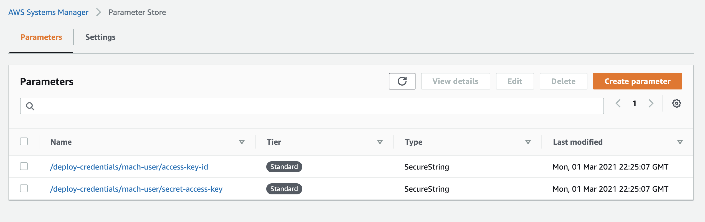

# Step 6. Create your MACH stack



## 1. Create MACH composer configuration file

To create a new MACH composer configuration file, run

```bash
mach-composer bootstrap config
```

A configuration will be created and can be used as input for MACH composer.

Edit your configuration so that it looks like the following example

```yaml
---
mach_composer:
  version: 1.0.0
global:
  environment: test
  cloud: aws
  terraform_config:
    aws_remote_state:
    bucket: your-project-tst-tfstate
    key_prefix: mach
    region: eu-central-1
sites:
  - identifier: my-site-tst
    aws:
      account_id: ...
      region: eu-central-1
    commercetools:
      project_key: my-site-tst
      client_id: ...
      client_secret: ...
      scopes: manage_project:my-site-tst manage_api_clients:my-site-tst view_api_clients:my-site-tst
      languages:
        - en-GB
        - nl-NL
      currencies:
        - GBP
        - EUR
      countries:
        - GB
        - NL
    components:
      - name: api
components:
  - name: api
    source: ../components/api-component/terraform
    endpoints:
      main: default
    version: dev
```

!!! note "Component source"
    We defined our component source as `source: ../components/api-component/terraform`.<br>
    This is a path relative to the MACH composer configuration file itself. Edit
    your path so that it fits your current setup.

    During actual development and deployment this will usually point to a Git repository.

See [Syntax](../../reference/syntax/index.md) for all configuration options.

## 2. Configure credentials

In [step 4](./step-4-setup-aws-site.md) we've used the
[`terraform-aws-mach-account` module](https://github.com/labd/terraform-aws-mach-account)
to setup the AWS account for us.

This also created an IAM **user** called `mach` and a **role** `mach` that we
can use to perform MACH composer deployments with.

In this tutorial, we'll be using the `mach` role so we can configure the
credentials in the same fashion we did for the
[component upload](./step-5-create-component.md#upload):

Make sure the following is added to your `~/.aws/config` file:

```conf
[profile your-project-tst]
source_profile = default
role_arn = arn:aws:iam::<service-account-id>:role/mach
```

!!! tip "Using the `mach` user"
    In order to use this user, go to your AWS console and open the
    **Systems Manager Parameter Store** to view the credentials.

    

    These credentials can be used directly in your local AWS setup or in your CI/CD pipeline.


## 3. Deploy

You can deploy your current configuration by running

```bash
$ mach-composer apply
```

!!! tip "Providing AWS credentials"
    How you provide the AWS credentials is dependent on your local setup.

    For example; you could invoke this with
    `AWS_DEFAULT_PROFILE=your-project-tst mach-composer apply` or with
    [aws-vault](https://github.com/99designs/aws-vault):

    ```bash
    aws-vault exec your-project-tst -- mach-composer apply
    ```


After confirming the changes, you will see a success output like this:

```bash
Apply complete! Resources: 6 added, 0 changed, 0 destroyed.

Outputs:

endpoints = {
  "default" = "https://cytbsqhtp5.execute-api.eu-central-1.amazonaws.com"
}
Done 👍
```

If you now append the endpoint with `/api/healthcheck` you have the URL of the
API endpoint we created in our component:

```bash
$ curl https://cytbsqhtp5.execute-api.eu-central-1.amazonaws.com/api/healthcheck
> {"ok":true,"version":"dev","environment":"test"}
```

## Example files

You can find example files needed for preparing the infrastructure and a
configuration file [on GitHub](https://github.com/labd/mach-composer/tree/master/examples/aws) in the
[/examples](https://github.com/labd/mach-composer/tree/master/examples/aws)
directory

## Further reading

- See the [CLI reference](../../reference/cli.md#apply) for more deployment options.
- Setup your CI/CD pipeline on [GitLab](../../howto/ci/gitlab.md), [GitHub](../../howto/ci/github.md) or [Azure DevOps](../../howto/ci/devops.md)
- [Encrypting your configuration](../../howto/security/encrypt.md) with SOPS
- How to create a [new MACH component](../../howto/components/create-component.md)
- [Architectural Guidance](../../topics/architecture/index.md)

